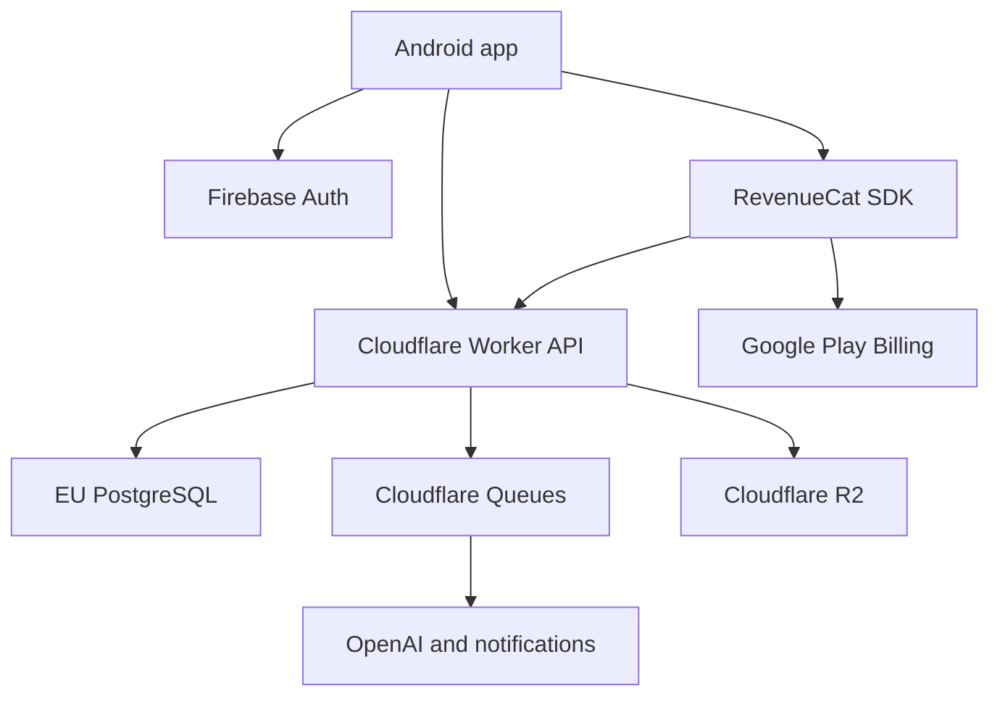

# EvenUp Production Architecture

**Status:** Accepted architecture baseline for the post-MVP production phase  
**Last updated:** 2026-07-22  
**Scope:** Authentication and profile, friends, expense history and activity, subscriptions, and the platform capabilities required to operate them reliably

## 1. Purpose

This document defines the target production architecture and the contracts that new server-backed features must follow. It extends the pitch-ready MVP described by `MVP_SCOPE.md`, `ARCHITECTURE.md`, and `API_CONTRACT.md`; it does not silently change the behavior of the existing v1 app or public guest links.

The design is intended to:

- scale from the current solo-developed MVP to a growing multi-user service;
- preserve clear ownership, authorization, and data-source boundaries;
- support retries, concurrent edits, provider outages, and safe deployments;
- add product features without an early backend rewrite or premature microservices;
- keep AI cost controls and paid entitlements enforceable on the server;
- support EU data residency and GDPR operations.

This is an architecture and contract artifact. Exact screen behavior, pricing, free quotas, retention periods, and provider pricing remain product or operational decisions unless explicitly fixed below.

## 2. Accepted decisions

| Concern | Decision |
| --- | --- |
| Backend shape | One modular TypeScript Cloudflare Worker deployment |
| Product database | Managed PostgreSQL in an EU region |
| Worker/database connection | Cloudflare Hyperdrive |
| Identity provider | Firebase Authentication |
| Authorization | EvenUp Worker policies backed by PostgreSQL |
| Subscription lifecycle | RevenueCat backed by Google Play Billing |
| Server entitlement enforcement | PostgreSQL entitlement mirror maintained from RevenueCat events and reconciliation |
| Files | Cloudflare R2 for avatars and future receipt assets only |
| Background work | Cloudflare Queues with retry and dead-letter handling |
| Android persistence | Room for server-backed cache; DataStore for small preferences and in-progress local drafts |
| Current D1 data | Retain as a legacy read source during migration; do not expand it into the social database |
| Service decomposition | No microservices until measured load or operational ownership justifies extraction |

Firebase is an identity provider, not the product database. RevenueCat is the purchase-state provider, not the only authorization source. The Android app is never authoritative for access to paid AI operations.

## 3. Quality targets

Initial production objectives, to be reviewed after real traffic exists:

- 99.9% monthly availability for authenticated non-AI API operations.
- p95 under 500 ms for ordinary EU-region reads and writes, excluding client network time.
- No acknowledged expense mutation lost after a successful response.
- Recovery point objective of 5 minutes or better for PostgreSQL.
- Recovery time objective of 4 hours or better for a regional database incident.
- All security-sensitive mutations traceable by request ID and actor without logging private expense content.
- AI and webhook failures retryable without duplicate charges, usage, activities, or product mutations.

These are engineering objectives, not a public SLA.

## 4. System context



The Worker is the only public product-data boundary. Android does not connect directly to PostgreSQL, D1, R2, OpenAI, or RevenueCat secret APIs.

## 5. Sources of truth

| Data | Authoritative source | Local/derived copy |
| --- | --- | --- |
| Sign-in identity and provider links | Firebase Authentication | Verified token claims per request |
| EvenUp user ID, profile, username, settings | PostgreSQL | Room cache |
| Friends, blocks, and invitations | PostgreSQL | Room cache |
| Expenses, participants, allocations, and settlements | PostgreSQL | Room cache and immutable share snapshot |
| Subscription purchase lifecycle | RevenueCat | Raw event log in PostgreSQL |
| Effective EvenUp entitlement and AI allowance | PostgreSQL | Short-lived Android display cache |
| Avatar and future binary objects | R2 | CDN/device cache |
| Existing anonymous public shares | D1 during migration | Optional PostgreSQL legacy import |
| In-progress expense drafts and preferences | Android DataStore/Room | Not server-authoritative until saved |

## 6. Backend structure

Refactor `backend/src/index.js` incrementally into a modular monolith:

```text
backend/src/
├── app.ts
├── routes/
├── auth/
├── users/
├── friends/
├── expenses/
├── activity/
├── billing/
├── ai/
├── sharing/
├── storage/
├── jobs/
└── infrastructure/
    ├── database/
    ├── http/
    ├── logging/
    ├── queues/
    └── security/
```

Each product module owns route handlers, application services, repository interfaces, validation, authorization policies, and tests. Infrastructure modules provide PostgreSQL, D1 legacy access, R2, queues, provider clients, logging, and configuration.

Route handlers must remain thin: parse and validate input, authenticate, call one application service, and serialize a stable response. Business rules and authorization must not be distributed across handlers.

Use one database transaction for every mutation that changes multiple records. No module may publish directly to a queue inside the transaction; it inserts an outbox record instead.

## 7. Identity and authorization

### 7.1 Authentication flow

1. Android signs in with Firebase Authentication and obtains an ID token.
2. Android sends `Authorization: Bearer <id-token>` to the Worker.
3. The Worker verifies signature, algorithm, key ID, issuer, audience, subject, issue/expiry time, and required claims.
4. The Worker maps `firebase_uid` to a stable internal EvenUp UUID.
5. Authorization policies evaluate that internal user ID and current database state.

Public keys may be cached according to their HTTP cache headers. An unverified JWT payload must never be used for identity. Firebase custom claims must not replace EvenUp's database authorization model.

Account deletion and other high-risk operations require a recently authenticated token. The implementation must also have a revocation-aware verification path for these operations.

### 7.2 Authorization matrix

| Operation | Anonymous | Expense owner | Registered participant | Friend/other user |
| --- | --- | --- | --- | --- |
| Health check | Allow | Allow | Allow | Allow |
| Use protected v2 APIs | Deny | Allow as policy permits | Allow as policy permits | Allow as policy permits |
| Read/update own profile | Deny | Own profile only | Own profile only | Own profile only |
| Exact username lookup | Deny | Allow, rate-limited | Allow, rate-limited | Allow, rate-limited |
| Send/accept friend request | Deny | Allow unless blocked | Allow unless blocked | Allow unless blocked |
| Create expense | Deny | Allow | Allow | Allow |
| Read saved expense | Passcode share only | Allow | Allow | Deny unless shared explicitly |
| Edit/delete expense in first production release | Deny | Allow with version check | Deny | Deny |
| Read own history/activity | Deny | Allow | Allow | Own feed only |
| Run paid AI operation | Product policy | Entitlement and quota required | Entitlement and quota required | Entitlement and quota required |
| RevenueCat webhook | Valid webhook credential only | N/A | N/A | N/A |

Every object lookup must include or follow with an authorization check. Possession of an object UUID is never authorization.

Blocked users cannot discover each other, create friend requests, or use a friendship to gain access. Blocking does not rewrite historical expense snapshots.

## 8. PostgreSQL data contract

All primary IDs are UUIDs generated server-side. Timestamps use `TIMESTAMPTZ` in UTC. Money uses signed `BIGINT` minor units plus an ISO 4217 currency code. Percentage values use integer basis points. Quantities use fixed-precision `NUMERIC`, never floating point.

The following is the logical schema. Production migrations may add technical columns but must preserve these constraints.

### 8.1 Accounts and social graph

```sql
CREATE TABLE users (
  id UUID PRIMARY KEY,
  firebase_uid TEXT NOT NULL UNIQUE,
  state TEXT NOT NULL CHECK (state IN ('ACTIVE', 'DELETION_PENDING', 'DELETED')),
  created_at TIMESTAMPTZ NOT NULL,
  updated_at TIMESTAMPTZ NOT NULL,
  deleted_at TIMESTAMPTZ
);

CREATE TABLE profiles (
  user_id UUID PRIMARY KEY REFERENCES users(id),
  username TEXT NOT NULL,
  username_normalized TEXT NOT NULL UNIQUE,
  display_name TEXT NOT NULL,
  avatar_object_key TEXT,
  default_currency CHAR(3) NOT NULL,
  locale TEXT NOT NULL,
  version BIGINT NOT NULL DEFAULT 1,
  updated_at TIMESTAMPTZ NOT NULL
);

CREATE TABLE friend_requests (
  id UUID PRIMARY KEY,
  requester_id UUID NOT NULL REFERENCES users(id),
  recipient_id UUID NOT NULL REFERENCES users(id),
  status TEXT NOT NULL CHECK (status IN ('PENDING', 'ACCEPTED', 'DECLINED', 'CANCELLED')),
  created_at TIMESTAMPTZ NOT NULL,
  resolved_at TIMESTAMPTZ,
  CHECK (requester_id <> recipient_id)
);

CREATE UNIQUE INDEX uq_pending_friend_request_pair
  ON friend_requests (LEAST(requester_id, recipient_id), GREATEST(requester_id, recipient_id))
  WHERE status = 'PENDING';

CREATE TABLE friendships (
  user_low_id UUID NOT NULL REFERENCES users(id),
  user_high_id UUID NOT NULL REFERENCES users(id),
  created_at TIMESTAMPTZ NOT NULL,
  PRIMARY KEY (user_low_id, user_high_id),
  CHECK (user_low_id < user_high_id)
);

CREATE TABLE blocked_users (
  blocker_id UUID NOT NULL REFERENCES users(id),
  blocked_id UUID NOT NULL REFERENCES users(id),
  created_at TIMESTAMPTZ NOT NULL,
  PRIMARY KEY (blocker_id, blocked_id),
  CHECK (blocker_id <> blocked_id)
);
```

Invitation tokens are random values whose hashes, expiry, inviter, and optional acceptance are stored in `friend_invites`. Raw invitation tokens must not be stored.

### 8.2 Expenses and history

```sql
CREATE TABLE expenses (
  id UUID PRIMARY KEY,
  owner_id UUID NOT NULL REFERENCES users(id),
  title TEXT NOT NULL,
  currency CHAR(3) NOT NULL,
  total_minor BIGINT NOT NULL,
  transaction_date DATE,
  state TEXT NOT NULL CHECK (state IN ('ACTIVE', 'DELETED')),
  version BIGINT NOT NULL DEFAULT 1,
  snapshot_schema_version INTEGER NOT NULL,
  snapshot_json JSONB NOT NULL,
  created_at TIMESTAMPTZ NOT NULL,
  updated_at TIMESTAMPTZ NOT NULL,
  deleted_at TIMESTAMPTZ
);

CREATE TABLE expense_participants (
  id UUID PRIMARY KEY,
  expense_id UUID NOT NULL REFERENCES expenses(id),
  user_id UUID REFERENCES users(id),
  display_name_snapshot TEXT NOT NULL,
  creation_order INTEGER NOT NULL,
  paid_minor BIGINT NOT NULL,
  UNIQUE (expense_id, creation_order)
);

CREATE TABLE expense_items (
  id UUID PRIMARY KEY,
  expense_id UUID NOT NULL REFERENCES expenses(id),
  name TEXT NOT NULL,
  quantity NUMERIC(12, 3),
  total_minor BIGINT,
  creation_order INTEGER NOT NULL,
  UNIQUE (expense_id, creation_order)
);

CREATE TABLE expense_allocations (
  id UUID PRIMARY KEY,
  expense_id UUID NOT NULL REFERENCES expenses(id),
  item_id UUID REFERENCES expense_items(id),
  participant_id UUID NOT NULL REFERENCES expense_participants(id),
  allocation_type TEXT NOT NULL,
  amount_minor BIGINT NOT NULL,
  percentage_basis_points INTEGER,
  units NUMERIC(12, 3)
);

CREATE TABLE settlements (
  id UUID PRIMARY KEY,
  expense_id UUID NOT NULL REFERENCES expenses(id),
  from_participant_id UUID NOT NULL REFERENCES expense_participants(id),
  to_participant_id UUID NOT NULL REFERENCES expense_participants(id),
  amount_minor BIGINT NOT NULL CHECK (amount_minor > 0),
  status TEXT NOT NULL CHECK (status IN ('PENDING', 'PAID', 'CANCELLED')),
  version BIGINT NOT NULL DEFAULT 1,
  paid_at TIMESTAMPTZ
);
```

Required history indexes:

```sql
CREATE INDEX idx_expenses_owner_history
  ON expenses (owner_id, created_at DESC, id DESC)
  WHERE state = 'ACTIVE';

CREATE INDEX idx_expense_participants_user
  ON expense_participants (user_id, expense_id)
  WHERE user_id IS NOT NULL;
```

The normalized rows support authorization, history, filtering, and future collaboration. `snapshot_json` preserves the finalized calculation and share rendering exactly as saved. A profile rename never changes `display_name_snapshot` in historical expenses.

### 8.3 Activity, reliability, billing, and usage

Logical tables:

- `activity_events`: append-only actor, audience/subject, event type, aggregate reference, safe payload, and occurrence time.
- `outbox_events`: transactionally inserted event, payload, attempt count, next-attempt time, and published time.
- `idempotency_records`: actor, route, key, request hash, processing state, stored response, and expiry; unique by actor/route/key.
- `public_shares`: expense, random token hash, passcode hash/salt, expiry, revocation, and creation time.
- `entitlements`: user, entitlement key, effective status, product, expiry, grace state, provider update time, and version.
- `subscription_events`: unique provider event ID, environment, event type, customer ID, received/processed times, and raw JSON for restricted debugging.
- `usage_counters`: user, feature key, UTC billing period, atomically updated used amount, and policy version.
- `account_deletion_requests`: user, request time, execution status, and completion time.

Activity is a projection of committed domain events. It must never be required for the expense transaction to succeed, and it must be rebuildable from durable events where practical.

## 9. API v2 contract

All v2 JSON endpoints use HTTPS, UTF-8 JSON, bearer authentication unless marked public, and a request ID. Mutations accept `Idempotency-Key`; updates also require an entity version through `If-Match` or an equivalent explicit field.

### 9.1 Common response rules

Successful collection responses use cursor pagination:

```json
{
  "items": [],
  "nextCursor": "opaque-or-null"
}
```

The cursor encodes the last stable sort tuple, such as `(created_at, id)`, and is opaque to Android. Page-number pagination is not permitted for mutable history feeds.

Errors use one envelope:

```json
{
  "error": {
    "code": "EXPENSE_VERSION_CONFLICT",
    "message": "This expense changed. Refresh and try again.",
    "requestId": "req_...",
    "details": {}
  }
}
```

Stable categories include `INVALID_INPUT` (400), `AUTH_REQUIRED` (401), `FORBIDDEN` (403), `NOT_FOUND` (404), `VERSION_CONFLICT` (409), `RATE_LIMITED` (429), and `DEPENDENCY_UNAVAILABLE` (503). Error messages must not reveal whether a protected username, share, or resource exists when that would enable enumeration.

### 9.2 Endpoint inventory

Accounts and profile:

```http
POST   /v2/account/bootstrap
GET    /v2/profile
PATCH  /v2/profile
DELETE /v2/account
GET    /v2/usernames/:username/availability
GET    /v2/users/search?username=<exact-normalized-value>
```

Friends:

```http
GET    /v2/friends?cursor=<cursor>
GET    /v2/friend-requests?direction=incoming|outgoing&cursor=<cursor>
POST   /v2/friend-requests
POST   /v2/friend-requests/:id/accept
POST   /v2/friend-requests/:id/decline
DELETE /v2/friend-requests/:id
DELETE /v2/friends/:userId
POST   /v2/blocks
DELETE /v2/blocks/:userId
POST   /v2/friend-invites
POST   /v2/friend-invites/:token/accept
```

Expenses and history:

```http
POST   /v2/expenses
GET    /v2/expenses?cursor=<cursor>&role=all|owned|participant
GET    /v2/expenses/:expenseId
PATCH  /v2/expenses/:expenseId
DELETE /v2/expenses/:expenseId
POST   /v2/expenses/:expenseId/shares
DELETE /v2/expenses/:expenseId/shares/:shareId
```

The first production release allows only the owner to edit or delete an expense. Registered participants have read access while membership exists. Each create/update operation validates that money reconciles, participant references belong to the expense, allocations are complete, and the supplied version is current.

Activity and billing:

```http
GET  /v2/activity?cursor=<cursor>
GET  /v2/entitlements
POST /internal/webhooks/revenuecat
```

The full activity endpoint may be released after expense history, but emitted event contracts must be introduced with the expense mutations so the feed can be built without another data-model rewrite.

AI jobs:

```http
POST /v2/ai/interpretation-jobs
POST /v2/ai/receipt-jobs
GET  /v2/ai/jobs/:jobId
DELETE /v2/ai/jobs/:jobId
```

Job creation atomically reserves allowed usage and returns `202 Accepted`. The queue consumer completes the job, records billable usage once, and releases or adjusts a reservation on terminal provider failure. Existing synchronous v1 AI endpoints remain available only during migration and under stricter rate and cost controls.

## 10. Mutation and concurrency rules

### 10.1 Idempotency

Expense creation, settlements, friend requests, invitation acceptance, AI job creation, and webhook processing are idempotent.

For an `Idempotency-Key` mutation, the Worker:

1. hashes the validated request body;
2. inserts or locks the actor/route/key record;
3. rejects reuse with a different request hash;
4. performs the product mutation in a transaction;
5. stores the final status and response;
6. returns the stored response for a retry.

Android generates a new UUID key for each user intent and reuses it only when retrying that same intent.

### 10.2 Optimistic concurrency

Mutable aggregates have a monotonically increasing `version`. Updates use a condition equivalent to:

```sql
UPDATE expenses
SET ..., version = version + 1
WHERE id = $expense_id AND owner_id = $actor_id AND version = $expected_version;
```

Zero updated rows produce `409 VERSION_CONFLICT`. The server never silently overwrites a newer expense version.

### 10.3 Transactional outbox

The product mutation and its outbox event commit together. A publisher reads unpublished outbox rows, sends queue messages, and marks them published. Queue consumers are idempotent because queue delivery and provider webhooks may occur more than once.

Failed messages use bounded exponential backoff and a dead-letter queue. DLQ age and depth are alerts, not a place where failures are forgotten.

## 11. Subscription and AI enforcement

RevenueCat's App User ID is the stable internal EvenUp user UUID, never an email or display name. After account bootstrap, Android identifies the RevenueCat SDK with that value.

The webhook route must:

- authenticate a configured authorization header;
- distinguish sandbox and production events;
- persist the unique provider event before processing;
- safely acknowledge duplicate events;
- update the entitlement mirror transactionally;
- enqueue downstream activity only through the outbox;
- retain restricted raw payloads for a defined troubleshooting period;
- support periodic reconciliation against RevenueCat.

Android may use RevenueCat state to render responsive UI, but the Worker checks the PostgreSQL entitlement mirror and current usage policy before starting paid AI work. A modified APK therefore cannot bypass quotas.

Free quotas, subscription tiers, grace behavior, and feature limits are data-driven policies. Each usage decision records the applied policy version. Usage reservation and increment are atomic so concurrent requests cannot exceed a quota through a race.

## 12. Public shares and legacy D1

Public sharing remains token-based and passcode-gated. New share URLs contain a high-entropy random token; the database stores a token hash. Share records can be revoked or expired independently of the expense.

During migration:

- existing `/v1` API and `/e/:shareId` behavior remains backward compatible;
- the guest route checks PostgreSQL for new shares and falls back to D1 for legacy shares;
- old D1 rows are not assigned to users automatically because they have no authenticated ownership proof;
- an optional future claim/import flow must require possession of the link and passcode plus explicit user confirmation;
- after a monitored migration window, D1 becomes read-only and can later be retired under a documented retention plan.

Do not dual-write new v2 product data to D1. PostgreSQL is authoritative from the first v2 write.

## 13. Android architecture

Preserve the repository's Clean Architecture and API/implementation module rule. Add modules only when their boundary is used by more than one feature or contains independent business rules.

Recommended additions:

```text
:core:auth:api / :core:auth:impl
:core:database:api / :core:database:impl
:core:billing:api / :core:billing:impl

:domain:account:api / :domain:account:impl
:domain:social:api / :domain:social:impl
:domain:entitlement:api / :domain:entitlement:impl

:data:account:api / :data:account:impl
:data:social:api / :data:social:impl
:data:history:api / :data:history:impl
:data:billing:api / :data:billing:impl

:feature:account:api / :feature:account:impl
:feature:friends:api / :feature:friends:impl
:feature:history:api / :feature:history:impl
:feature:subscription:api / :feature:subscription:impl
```

Reuse the existing expense domain rather than creating a second history-specific expense model. Hilt remains the only dependency-injection framework.

Room stores cached profiles, friends, history pages, entitlement display state, and sync metadata. Server responses are mapped into domain models; network DTOs and Room entities do not escape data implementations.

Initial offline behavior:

- cached history and friends remain readable;
- profile/social mutations require connectivity and expose retryable errors;
- existing local expense drafts remain usable;
- finalized server saves retry with the same idempotency key;
- collaborative offline editing is not supported in the first production release.

## 14. Security and privacy requirements

- Separate development, staging, and production Firebase projects, databases, R2 buckets, queues, secrets, and RevenueCat environments.
- Store secrets only in platform secret stores; never in Android, source control, logs, or plain Worker variables.
- Validate every request body with explicit size and shape limits.
- Rate-limit authentication bootstrap, exact username lookup, friend requests, share access, AI job creation, and webhooks independently.
- Prevent username enumeration through exact lookup, blocking rules, generic errors, and conservative rate limits.
- Keep receipt images ephemeral unless a future feature explicitly requires storage and consent.
- Use signed, short-lived upload authorization for R2; validate MIME type and size server-side.
- Encrypt provider connections in transit and use least-privilege database roles.
- Do not cache authenticated or mutable responses in Hyperdrive/query caches unless correctness is proven for that query.
- Soft deletion is not a substitute for GDPR erasure. The deletion worker must remove or irreversibly anonymize profile/social data and R2 objects, revoke shares, and call provider deletion APIs where required.
- Financial records retained for fraud, dispute, or legal reasons must have a documented legal basis and retention period.
- Logs must contain identifiers, safe codes, timings, and counts—not receipt images, transcripts, AI prompts/output, access tokens, passcodes, or full expense payloads.

Primary threats to test are IDOR, JWT spoofing, token replay, username enumeration, share brute force, duplicate webhooks, forged subscription state, AI budget abuse, and cross-user cache leakage.

## 15. Operations and delivery

### 15.1 Observability

Propagate one request ID from Android through the Worker, database/outbox event, queue job, and provider call. Emit structured logs and metrics for:

- request count, latency, result code, and authenticated/anonymous class;
- database and Hyperdrive failures;
- queue age, retry count, and DLQ depth;
- webhook processing delay and reconciliation drift;
- AI success, provider code, latency, token/cost metadata, and reservation outcome;
- entitlement denials and quota exhaustion;
- migration and legacy D1 fallback usage.

Alert on SLO burn, elevated 5xx/429 rates, database saturation, oldest outbox age, non-empty DLQ, webhook lag, entitlement reconciliation mismatch, and abnormal AI spend.

### 15.2 Backups and disaster recovery

- Select an EU PostgreSQL plan with automated backups and point-in-time recovery.
- Test a restore into an isolated environment at least quarterly.
- Version R2 lifecycle and deletion policies.
- Document provider outage modes and a manual entitlement reconciliation runbook.
- Keep migrations and rollback/forward-fix instructions in source control.

### 15.3 Deployment rules

Use expand/migrate/contract database changes:

1. add backward-compatible schema;
2. deploy code that understands old and new shapes;
3. backfill and verify;
4. switch reads/writes behind a feature flag;
5. remove old shape only in a later deploy.

Never combine an irreversible schema contraction with the first code deployment that stops using the old field. Worker releases must be rollback-capable, and queues must tolerate mixed producer/consumer versions during rollout.

## 16. Phased implementation plan

### Phase P0 — Decisions and infrastructure

- Confirm PostgreSQL provider/region, backup/PITR plan, Firebase project, RevenueCat project/products, and privacy retention policy.
- Add development, staging, and production environment configuration.
- Introduce TypeScript, routing, validation, database migration tooling, structured logging, and test harness without changing v1 behavior.

### Phase P1 — Identity and account foundation

- Implement Firebase token verification and central authorization context.
- Add PostgreSQL/Hyperdrive and account/profile schema.
- Implement account bootstrap, profile, username, recent-auth deletion, and Android auth/account modules.
- Add authorization-policy and token-validation tests.

### Phase P2 — Expense ownership and history

- Add normalized expense schema and v2 expense transaction.
- Link registered participants while preserving name snapshots and unregistered guests.
- Add idempotency, optimistic concurrency, Room history cache, and cursor pagination.
- Keep v1 shares operational with PostgreSQL-first/D1-fallback guest reads.

### Phase P3 — Friends

- Implement exact-username search, requests, friendships, blocks, invitation links, and social cache.
- Add race, duplicate-request, reciprocal-request, block, and enumeration tests.

### Phase P4 — Entitlements and AI metering

- Integrate RevenueCat identity, entitlement webhook log/mirror, reconciliation, and paywall.
- Add atomic policy-based usage reservation and server enforcement.
- Move long-running receipt/interpretation work to queued jobs with retries and DLQ.

### Phase P5 — Activity and hardening

- Publish activity projections from the outbox and add the user feed if included in release scope.
- Run load, failure-injection, restore, privacy-deletion, and security tests.
- Establish alerts, dashboards, incident runbooks, and migration exit criteria.

Do not start Friends UI or the paywall before P1. Do not expose history until expense ownership and authorization are enforced server-side.

## 17. Required validation gates

Before production launch:

- every protected endpoint has positive and negative authorization tests;
- every retryable mutation has duplicate and mismatched-key idempotency tests;
- expense edits have stale-version conflict tests;
- migrations pass on an empty database and a production-like previous schema;
- queue consumers pass duplicate, retry, poison-message, and DLQ tests;
- RevenueCat webhooks pass credential, duplicate, out-of-order, sandbox, and reconciliation tests;
- AI quota tests prove concurrent requests cannot overspend a limit;
- cursor pagination has no duplicates or omissions under concurrent inserts;
- account deletion and share revocation are verified end to end;
- PostgreSQL restore and Worker rollback are rehearsed;
- Android builds and backend tests/type checks pass.

## 18. Open product and provider decisions

These decisions do not change the architecture, but must be resolved before their implementation phase:

- Google sign-in only, or Google plus email-link/password fallback.
- Whether an anonymous installation receives an AI trial; production v2 AI is authenticated by default.
- Free AI quotas, premium features, products, prices, grace behavior, and usage-reset timezone.
- Whether registered participants may edit expenses in a later release.
- Whether the first release includes the event feed or expense history only.
- PostgreSQL provider and exact EU region.
- Profile/avatar, financial record, raw webhook, and legacy share retention periods.
- Whether old anonymous shares can be claimed by a newly registered owner.

Record each resolved choice in an ADR or product requirements artifact. Do not encode pricing or quotas directly into UI code.

## 19. Implementation references

- [Cloudflare Hyperdrive](https://developers.cloudflare.com/hyperdrive/)
- [Connect Workers to PostgreSQL](https://developers.cloudflare.com/hyperdrive/examples/connect-to-postgres/)
- [Cloudflare Queues delivery guarantees](https://developers.cloudflare.com/queues/reference/delivery-guarantees/)
- [Cloudflare Queues dead-letter queues](https://developers.cloudflare.com/queues/configuration/dead-letter-queues/)
- [Firebase ID token verification](https://firebase.google.com/docs/auth/admin/verify-id-tokens)
- [Firebase session management](https://firebase.google.com/docs/auth/admin/manage-sessions)
- [RevenueCat common backend architecture](https://www.revenuecat.com/docs/guides/common-architecture)
- [RevenueCat webhooks](https://www.revenuecat.com/docs/integrations/webhooks)
- [Google Play Billing security](https://developer.android.com/google/play/billing/security)

